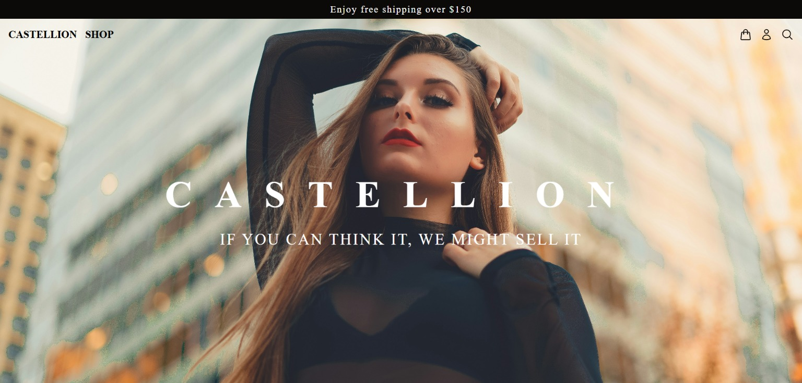
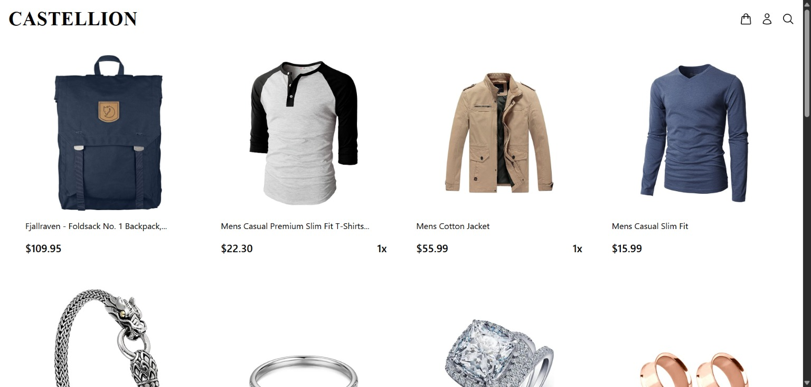

# 🏛️ Castellion – Modern E-Commerce SPA

**Castellion** is a sleek and performant single-page e-commerce application, developed with a focus on luxury design, scalability, and real-world functionality. Built using modern frontend technologies, it offers a rich shopping experience with authentication, a persistent cart, and stylish responsiveness.

> 🟢 **Live Site**: [https://castellion.netlify.app](https://castellion.netlify.app)

---

## 🔥 Preview

### 🖼️ Hero Landing Page

### 🛒 Product Showcase & Cart Preview

---

## ⚙️ Features

- 🛍️ **Product Catalog** – High-quality product cards with pricing  
- 🛒 **Cart System** – Add, remove, and update items with Redux  
- 🔐 **User Authentication** – Supabase-powered login/register  
- 💾 **Order Tracking** – Saved in **LocalStorage** for session recovery  
- 📱 **Responsive Design** – Tailwind-powered mobile-first UI  
- 🔄 **SPA Architecture** – Instant transitions via React Router  
- ⚛️ **Global State** – Redux used across auth/cart/order systems  

---

## 🛠️ Tech Stack

| Technology       | Purpose                                      |
|------------------|----------------------------------------------|
| **React**        | UI framework                                 |
| **React Router** | Single-page routing                          |
| **Redux**        | Global state management                      |
| **Tailwind CSS** | Utility-first responsive styling             |
| **Supabase**     | Backend-as-a-Service for user authentication |
| **LocalStorage** | Persistent order history                     |
| **Git**          | Version control                              |

